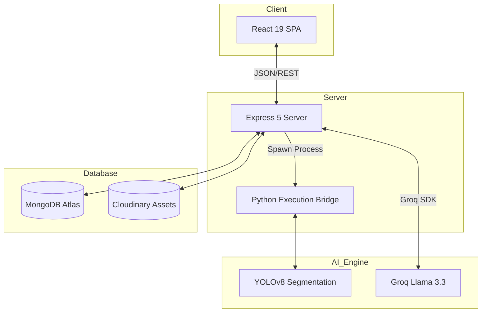

# 👁️ Project DR: Next-Gen AI Retinal Diagnostics

Project DR is a production-grade, AI-powered diagnostic platform designed to revolutionize Diabetic Retinopathy (DR) screening. By leveraging state-of-the-art computer vision (YOLOv8) and large language models (Llama 3.3), it provides clinicians with instant, high-precision analysis of retinal fundus images.

---

## 🚀 Key Features

### 🏥 Diagnosis Center Portal
- **Rapid Scan Triage**: Specialized workflow for technicians to upload and analyze retinal scans in seconds.
- **Intelligent Grouping**: Automatic **Bilateral (Double Eye) Report** generation for scans taken within a 5-minute window.
- **Global Patient Search**: Instantly retrieve historical reports and analysis for any patient in the registry.
- **Specialist Referrals**: Secure P2P referral system to send AI reports to expert ophthalmologists for review.

### 👨‍⚕️ Specialist (Doctor) Dashboard
- **Review Queue**: Streamlined interface for experts to analyze referred cases.
- **Verification Workflow**: Mark reports as "Reviewed" and provide professional validation of AI findings.
- **Source Attribution**: Full traceability back to the initiating center and technician.

### 👤 Patient Analytics
- **Health Trends**: Interactive **Recharts** visualizations tracking risk levels over time.
- **Transparent Reporting**: Access clinical-grade PDF reports with AI-generated summaries.
- **Multilingual Support**: Fully localized interface using i18next for global accessibility.

---

## 🛠️ Technology Stack

### **Frontend**
- **Core**: React 19 (Vite)
- **Styling**: Tailwind CSS 4 & Vanilla CSS
- **Animations**: Framer Motion (for high-fidelity micro-interactions)
- **State**: React Context API (Auth, Theme, Language)
- **Reporting**: jsPDF for dynamic report generation

### **Backend & AI**
- **Server**: Node.js 22+ & Express 5 (Experimental)
- **Database**: MongoDB Atlas with Mongoose
- **AI Vision**: YOLOv8 (Ultralytics) for lesion segmentation
- **AI Language**: Groq Llama 3.3 (70B) for clinical report summarization
- **Storage**: Cloudinary (for secure medical image hosting)

---

## 🏗️ Project Architecture



---

## 🏁 Getting Started

### Prerequisites
- **Node.js**: v20+ recommended
- **Python**: 3.9+ (with `pip`)
- **Accounts**: MongoDB Atlas, Cloudinary, Groq API (for reporting)

### Installation

1. **Clone & Install Root**:
   ```bash
   git clone https://github.com/your-repo/Project_DR.git
   cd Project_DR
   npm install
   ```

2. **Setup Backend**:
   ```bash
   cd backend
   npm install
   # Create .env with MONGO_URI, JWT_SECRET, CLOUDINARY_URL, GROQ_API_KEY
   ```

3. **Setup Frontend**:
   ```bash
   cd ../frontend
   npm install
   # Create .env with VITE_API_BASE_URL
   ```

### Execution
From the root directory, start both servers concurrently:
```bash
npm run dev
```

---

## 📈 Recent Improvements
- **Refined Grouping Logic**: Reduced bilateral grouping window to 5 minutes for extreme diagnostic precision.
- **Centralized Reporting**: Unified the `ReportModal` architecture for consistent viewing across all portals.
- **Premium UI Updates**: Implemented glassmorphism design language and Framer Motion transitions across dashboards.
- **Database Optimization**: Improved scan lookup performance and patient history indexing.

---

## 📄 License
This project is licensed under the ISC License.

---
**Disclaimer**: *This software is an AI-assisted diagnostic tool. All clinical decisions should be verified by a certified medical professional.*
