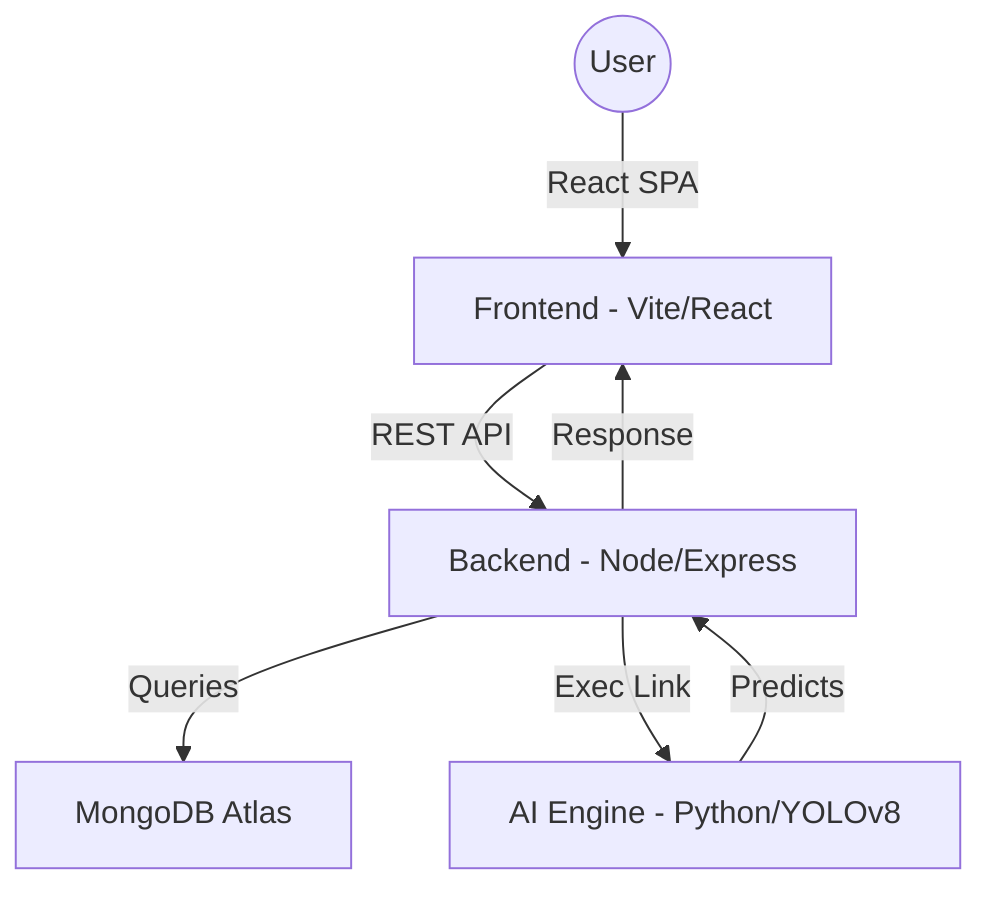

# Project DR: AI-Powered Retinal Scan Analysis

Project DR is a comprehensive full-stack platform designed to assist healthcare professionals in diagnosing Diabetic Retinopathy (DR) using AI-driven analysis of retinal fundus images. The system provides a seamless workflow from scan upload to automated risk assessment and patient reporting.

## 🚀 Vision
To empower clinicians with state-of-the-art AI insights, reducing the burden of manual screening and enabling early detection of diabetic retinopathy.

---

## 🛠 Tech Stack

### Frontend
- **Framework**: React 19 (Vite)
- **Styling**: Tailwind CSS 4, Framer Motion (for premium animations)
- **State Management**: React Context API (Auth, Theme, Language)
- **Visualization**: Recharts (for patient analytics)
- **Internationalization**: i18next

### Backend
- **Runtime**: Node.js with Express 5
- **Database**: MongoDB (Mongoose 9)
- **Security**: JWT Authentication, bcryptjs
- **File Handling**: Multer (for retinal image uploads)

### AI Engine
- **Model**: YOLOv8 (Inference using `best.pt`)
- **Bridge**: Python-Node.js Bridge for real-time inference execution.

---

## ✨ Key Features

### 👨‍⚕️ Doctor Dashboard
- **Patient Management**: Register and track patient health history.
- **Scan Analysis**: Upload retinal scans and trigger AI analysis.
- **Risk Assessment**: View automated risk levels (Low, Moderate, High) and lesion counts.
- **Reports**: Generate and finalize diagnostic reports for patients.

### 🏥 Diagnosis Centers
- **High-Volume Scanning**: Dedicated interface for centers to manage multiple scans.
- **Queue Management**: Monitor scan status from "Pending" to "Reviewed".

### 👤 Patient Portal
- **Dashboard**: View personal health summary and scan history.
- **Analytics**: Interactive charts visualizing risk progression and health metrics.
- **Report Downloads**: Securely access and download PDF reports.

---

## 🏗 Project Architecture



---

## 🏁 Getting Started

### Prerequisites
- Node.js (v18+)
- MongoDB Atlas account (or local MongoDB)
- Python 3.9+ (for AI inference)

### Installation

1. **Clone the repository**:
   ```bash
   git clone <repository-url>
   cd Project_DR
   ```

2. **Install Root Dependencies**:
   ```bash
   npm install
   ```

3. **Install Component Dependencies**:
   ```bash
   npm run install:all
   ```

### Running the Project

1. **Configure Environment Variables**:
   Create a `.env` file in the `backend/` directory:
   ```env
   PORT=5001
   MONGO_URI=your_mongodb_connection_string
   JWT_SECRET=your_jwt_secret
   ```

2. **Start Development Server**:
   From the root directory, run:
   ```bash
   npm run dev
   ```
   This will concurrently start the backend (Port 5001) and frontend (Vite).

---

## 📂 Project Structure

- `frontend/`: React source code, components, and pages.
- `backend/`: Express server, controllers, models, and routes.
- `backend/ai/`: Python scripts for AI model inference.
- `backend/uploads/`: Storage for uploaded retinal images.

---

## 📄 License
This project is licensed under the ISC License.
