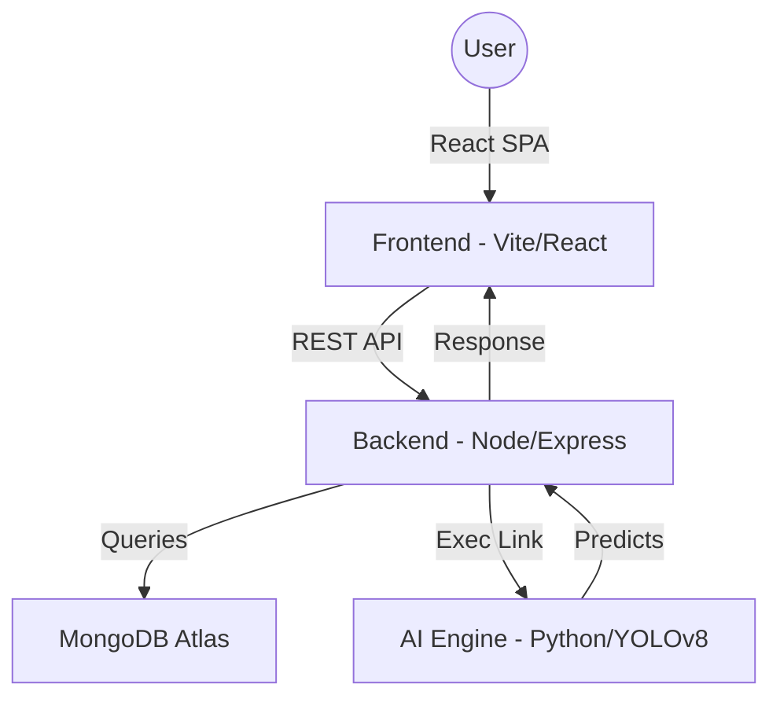

# Project DR: AI-Powered Retinal Scan Analysis

Project DR is a comprehensive full-stack platform designed to assist healthcare professionals in diagnosing Diabetic Retinopathy (DR) using AI-driven analysis of retinal fundus images. The system provides a seamless workflow from scan upload to automated risk assessment and patient reporting.

## 🚀 Vision
To empower clinicians with state-of-the-art AI insights, reducing the burden of manual screening and enabling early detection of diabetic retinopathy.

---

## 🛠 Tech Stack

### Frontend
- **Framework**: React 19 (Vite)
- **Styling**: Tailwind CSS 4, Framer Motion (for premium animations)
- **State Management**: React Context API (Auth, Theme, Language)
- **Visualization**: Recharts (for patient analytics)
- **Internationalization**: i18next

### AI & Reporting Engine
- **Generative Summaries**: Groq API integration using **Llama 3.3 (70B)** for lightning-fast clinical reporting.
- **Diagnostic Logic**: YOLOv8 backend (Python-Node.js Bridge) for real-time fundus image segmentation.
- **Tone & Accuracy**: Specialized medical prompts with low temperature (0.1) for forensic precision.

---

### 👨‍⚕️ Specialist Dashboard (Doctors)
- **Expert Review**: Analyze referred reports from external diagnosis centers.
- **Triage Queue**: Manage urgent high-risk cases via a streamlined clinical feed.
- **Provenance Tracking**: Trace every referral back to the specific initiating lab and technician.

### 🏥 Diagnosis Center Portal
- **Global Patient Registry**: Search and identify any patient in the system to review their historical records and AI reports.
- **Specialist Referrals**: Direct P2P transfer of diagnostic data to medical practitioners for formal review.
- **High-Volume Workflow**: Unified "Save & Analyze" logic for rapid diagnostic turnover.

### 👤 Patient Experience
- **Longitudinal Tracking**: View risk progression and health metrics through interactive Recharts analytics.
- **Clinical Summaries**: Access structured AI-generated summaries of eye health.
- **Secure Access**: Download verified diagnostic reports with full clinical metadata.

---

## 🏗 Project Architecture



---

## 🏁 Getting Started

### Prerequisites
- Node.js (v18+)
- MongoDB Atlas account (or local MongoDB)
- Python 3.9+ (for AI inference)

### Installation

1. **Clone the repository**:
   ```bash
   git clone <repository-url>
   cd Project_DR
   ```

2. **Install Root Dependencies**:
   ```bash
   npm install
   ```

3. **Install Component Dependencies**:
   ```bash
   npm run install:all
   ```

### Running the Project

1. **Configure Environment Variables**:
   Create a `.env` file in the `backend/` directory:
   ```env
   PORT=5001
   MONGO_URI=your_mongodb_connection_string
   JWT_SECRET=your_jwt_secret
   ```

2. **Start Development Server**:
   From the root directory, run:
   ```bash
   npm run dev
   ```
   This will concurrently start the backend (Port 5001) and frontend (Vite).

---

## 📂 Project Structure

- `frontend/`: React source code, components, and pages.
- `backend/`: Express server, controllers, models, and routes.
- `backend/ai/`: Python scripts for AI model inference.
- `backend/uploads/`: Storage for uploaded retinal images.

---

## 📄 License
This project is licensed under the ISC License.
