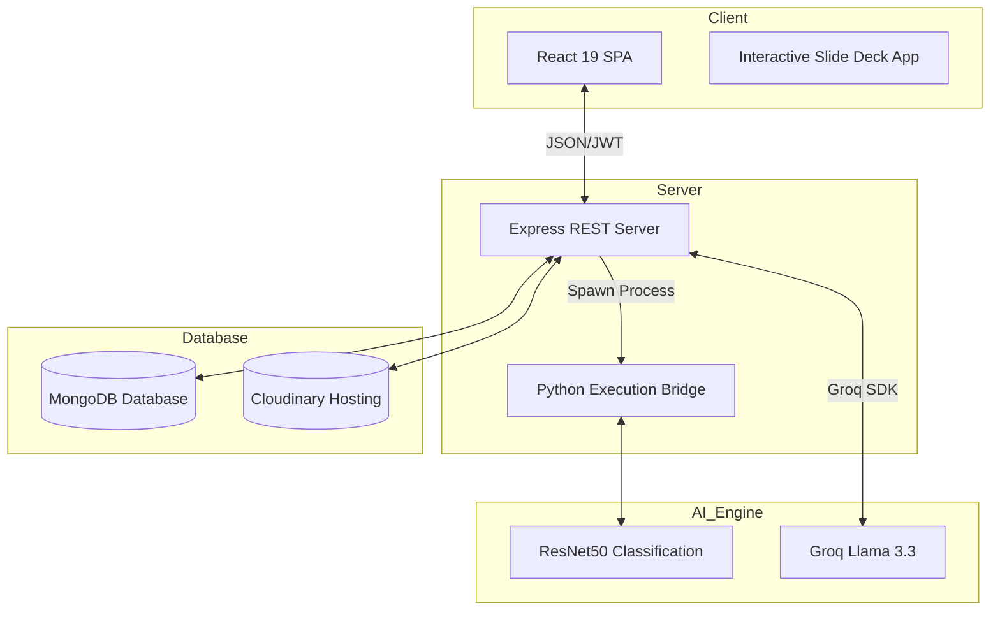

# 👁️ Retinal AI: Clinical Grade AI-Powered Bilateral Retinal scanning System (v1.0)

**Retinal AI** is a production-grade, AI-powered bilateral diagnostic platform designed to revolutionize Diabetic Retinopathy (DR) scanning. By leveraging state-of-the-art computer vision (ResNet50), large language models (Llama 3.3), and a secure multi-stakeholder ecosystem, Retinal AI provides doctors, patients, and diagnostic centers with high-precision bilateral analysis, official prescriptions, and real-time medical auditing.

---

## 🚀 Key Features

### 🔐 1. Super-Admin Auditing & Verification Portal
*   **Medical Security Gate:** Protects patient data by blocking unverified clinical registrations.
*   **Clinician & Center Segregation:** Dedicated, real-time lists and metrics for managing pending, verified, or rejected registrations.
*   **Super Credentials:** Secured under super-admin login (`admin@gmail.com` / `Mithun@1122`).
*   **Google Auth Security Gate:** Doctors and diagnostic center accounts created via Google Auth are automatically placed in `'pending'` state, requiring manual super-admin verification before logging in.

### 🏢 2. Diagnostic Center Portal
*   **Rapid Scan Intake:** Specialized workflow for technicians to upload Left & Right fundus scans in seconds.
*   **Bilateral Scan Grouping:** Automatically maps Left & Right eye studies side-by-side into a single report card.
*   **Sequential Scan ID Rule:** Automatically assigns unique, predictable IDs (e.g. `SCAN01`, `SCAN02`) for consistent tracking.
*   **Standardized Status Labeling:** Rebranded status tags globally from `"Analyzed"` to `"Generated"` to mark definitive clinical report issuance.

### 👨‍⚕️ 3. Specialist (Doctor) Dashboard
*   **Clinical Review Queue:** Streamlined interface for specialists to evaluate referred bilateral cases.
*   **Bilateral Side-by-Side Analytics:** High-fidelity fundus comparison with interactive AI severity classification metrics.
*   **Official Medical Prescriptions:** Centralized prescription block authorized by Dr. Mithun Kumar, styled to appear directly after the AI Clinical Analysis section.
*   **Smart Profile Progress Alerts:** Generates floating notices if critical licensing information is missing.

### 👤 4. Patient Analytics & Portal
*   **100% Profile Completion:** Redesigned progress utility that calculates completeness across Name, Email, Phone, DOB, and Gender, reaching exactly `100%` when form inputs are populated.
*   **Future-Date DOB Validation:** Calendar pickers globally lock out selections beyond today's date (`max={today}`). Backend routers validate incoming timestamps to prevent future-date injections.
*   **Dynamic Trend Tracking:** Interactive Recharts visualizations tracking long-term bilateral eye-health severity levels.

### 🎙️ 5. Voice-Enabled Persistent AI Assistant
*   **Hands-Free Mic Input:** Patients can interact verbally with the AI Assistant using browser Speech-to-Text.
*   **3s Silence Detection:** Intelligent voice submission trigger that automatically stops recording and dispatches messages after 3 seconds of inactivity, preventing duplicate requests.
*   **Persistent MongoDB History:** Backs up chat sessions permanently to MongoDB for subsequent recall.

---

## 🛠️ Technology Stack

### **Frontend**
*   **Framework:** React 19 (Vite)
*   **Styling:** Tailwind CSS 4 & Custom CSS (Glassmorphic theme)
*   **Icons:** Lucide Icons
*   **Animations:** Framer Motion (for smooth fluid slide-ins & micro-interactions)
*   **Reporting:** jsPDF (medical report card generators)

### **Backend & AI**
*   **Framework:** Node.js 22 & Express.js REST APIs
*   **Database:** MongoDB with Mongoose Schema mapping
*   **Authentication:** JWT tokens & Google OAuth 2.0 Integration
*   **AI Vision:** ResNet50 (PyTorch) multi-class fundus classification
*   **AI Language:** Groq Llama 3.3 for structured clinical summaries

---

## 🏗️ Project Architecture


```mermaid
graph TD
    subgraph Client
        UI[React 19 SPA]
        Slide[Interactive Slide Deck App]
    end

    subgraph Server
        API[Express REST Server]
        Bridge[Python Execution Bridge]
    end

    subgraph Database
        DB[(MongoDB Database)]
        CDN[(Cloudinary Hosting)]
    end

    subgraph AI_Engine
        Vision[ResNet50 Classification]
        LLM[Groq Llama 3.3]
    end

    UI <-->|JSON/JWT| API
    API <--> DB
    API <--> CDN
    API -->|Spawn Process| Bridge
    Bridge <--> Vision
    API <-->|Groq SDK| LLM
```

---

## 🏁 Getting Started

### Prerequisites
*   **Node.js**: v20+ recommended
*   **Python**: v3.9+
*   **API Accounts**: MongoDB, Cloudinary, Groq Cloud API

### Installation & Execution

1.  **Clone & Install Dependencies**:
    ```bash
    git clone https://github.com/your-repo/Project_DR.git
    cd Project_DR
    npm install
    ```

2.  **Run Development Servers**:
    Start the backend on port `5001` and the frontend on port `5173` concurrently:
    ```bash
    npm run dev
    ```

3.  **View Slide Presentation**:
    Open the newly generated, premium interactive slide presentation directly in your web browser:
    ```bash
    open presentation_deck.html
    ```

---

## 📈 Recent Improvements
*   **Global Brand Renaming:** Rewrote and synchronized branding occurrences from `"RetinaAI"` to `"Retinal AI"` across the entire frontend.
*   **Admin Access Protections:** Integrated verification checkpoints inside backend sign-in routers, blocking `'pending'` or `'rejected'` users from logging in via regular passwords or Google Auth.
*   **Systemic DOB Guardrails:** Added strict client-side limits and server-side validators preventing future-date entries.
*   **Reliable Completion Metrics:** Overhauled `profileUtils.js` to ensure users reach exactly `100%` profile completion without arbitrary image or description penalties.

---

## 📄 License
This project is licensed under the ISC License.

---
**Disclaimer**: *Retinal AI is an AI-assisted clinical scanning tool. All final diagnostics and prescriptions should be reviewed and verified by a certified medical professional.*
